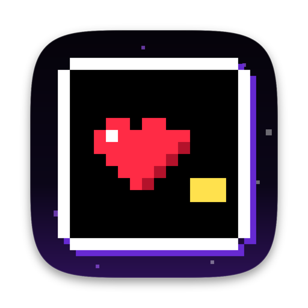

<p align="center"></p>

# Hopecode

A macOS desktop harness for [Claude Code](https://docs.anthropic.com/en/docs/claude-code) sessions: threads in a native chat UI, a per-thread terminal, and a pool of subscription accounts that rotates automatically when a usage limit is reached.

> Hopecode is an independent project and is not affiliated with or endorsed by Anthropic, OpenAI or Nous Research. Claude and Claude Code and their logos are trademarks of Anthropic. OpenAI, Codex and their logos are trademarks of OpenAI. Hermes and its logo are trademarks of Nous Research.
> Agent logos come from [@lobehub/icons](https://github.com/lobehub/lobe-icons) (MIT).

## Features

- **Threads** — Claude Code sessions (via the Claude Agent SDK) rendered as a native chat: streaming text, tool cards, diff view, permission prompts, per-thread model and permission mode. Each thread gets its own git worktree and survives app restarts (resume).
- **Terminal sidebar** — a shell per thread, opened in the thread's worktree (⌘J).
- **Account pool** — register several Claude subscription accounts (OAuth, isolated `CLAUDE_CONFIG_DIR` each, with `~/.claude` settings shared via symlinks). When the active account hits a limit, the next turn continues on the next available account with the same conversation. When every account is exhausted the thread waits and resumes automatically after the earliest reset. Extra-usage (overage) billing is never used.
- **Usage statusline** — pool-averaged 5h / weekly / Fable usage with time to the earliest reset, session time, context usage and `N/M avail`. Click for a per-account breakdown.
- **Accounts page** — add, rename, recolor, reorder (priority), enable/disable, pin to a thread, usage charts.
- **Codex threads** — run through the installed Codex, not a bundled one. Hopecode looks for `codex` in this order: Settings > Codex 실행 파일 경로 (optional override), the ChatGPT app (`/Applications/ChatGPT.app/Contents/Resources/codex-cli/bin/codex`, also `~/Applications`), the login shell's `PATH`, then `/opt/homebrew/bin`, `/usr/local/bin`, `~/.local/bin`. It keeps the highest `codex-cli` version that is **0.150.0 or newer**. If none is found, Codex shows as not installed: install the ChatGPT app or the Codex CLI. The Accounts page shows the engine path and version. Codex sign-in comes from Codex itself (`codex login` or the ChatGPT app, `~/.codex`).
  Hopecode bundles the [`@agentclientprotocol/codex-acp`](https://www.npmjs.com/package/@agentclientprotocol/codex-acp) adapter as one native binary. It passes `CODEX_PATH`, `CODEX_CONFIG` (model / reasoning effort) and `INITIAL_AGENT_MODE` through the environment. Permission chips map to modes as follows: 기본 / 편집 자동 승인 → `workspace-write`, 계획 → `read-only`, 전체 액세스 (after a confirmation) → `agent-full-access`. The adapter's default `agent` mode (Auto review: an automatic reviewer approves requests) is never used, and a switch to it is reverted.

## Theme

Hopecode uses a dark pixel RPG theme. The original assets are bundled: Galmuri11 / Galmuri14 (UI and conversation), Silkscreen (wordmark), JetBrains Mono (code), a pixel-heart mark and cursor. All fonts are SIL OFL 1.1; the license texts ship as `Contents/Resources/font-licenses`.

To use your own assets, put files in the `theme/` folder of the app data dir (`~/.hopecode/theme`) and restart the app. Each slot that holds a file replaces the bundled one; empty slots keep the original.

| File | Replaces |
| --- | --- |
| `fonts/ui.woff2` (or `.woff`, `.otf`, `.ttf`) | the UI, conversation and title font |
| `fonts/mono.woff2` (or `.woff`, `.otf`, `.ttf`) | code, diffs and the terminal |
| `sprites/heart.png` | the heart cursor on selected rows and the send button |
| `sprites/logo.png` | the brand mark (sidebar, new chat screen) |
| `palette.json` | design tokens, e.g. `{ "--accent": "#9B4DFF", "--select": "#FFE14D" }` (colors only) |

The app reads these files through the `hopecode-theme://` protocol. It serves only image and font files inside the folder, and it does not follow paths or symlinks that lead out of the folder. Hopecode does not download assets. Add only files you have the right to use.

## Development

```bash
npm install
npm run dev          # run the app
npm run typecheck
npm test             # unit / integration (vitest)
npm run test:e2e     # Playwright + Electron, hidden window, fixture mode
npm run dist:dir     # build dist/mac-arm64/Hopecode.app
```

Requirements: macOS (Apple Silicon), Node 22+. Codex threads also need the ChatGPT app or the Codex CLI (`codex-cli` 0.150.0+).

Building needs [bun](https://bun.sh). It is pinned as the `bun` devDependency, and `npm install` fetches it through bun's `postinstall`, which `allowScripts` in `package.json` permits. `scripts/build-codex-acp.mjs` compiles the codex-acp adapter to `build/bin/codex-acp` (`bun build --compile --target=bun-darwin-arm64`, about 60 MB, git-ignored). The script runs before `dev`, `build`, `test:e2e`, `dist:dir` and `smoke:native`, and skips the compile when the binary is current. The packaged app ships the binary in `Contents/Resources/bin/codex-acp`.

## Notes

- Usage numbers come from an undocumented OAuth usage endpoint used by Claude Code itself; it may change. Account rotation also works from Agent SDK rate-limit events alone.
- Only use accounts that belong to you, and review Anthropic's terms for your plan.
- 에이전트 로고: 에이전트 선택 칩과 대화 아바타는 `src/renderer/assets/agents/`의 로고를 씁니다(Claude Code는 공식 Claude 로고).
